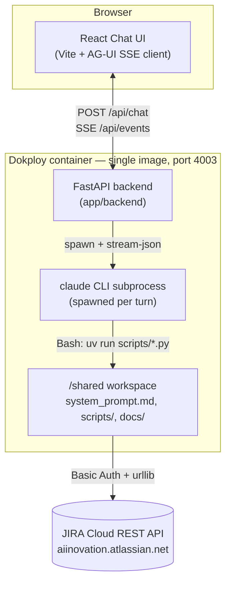
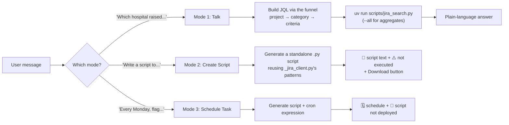
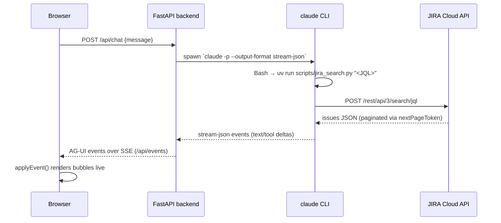
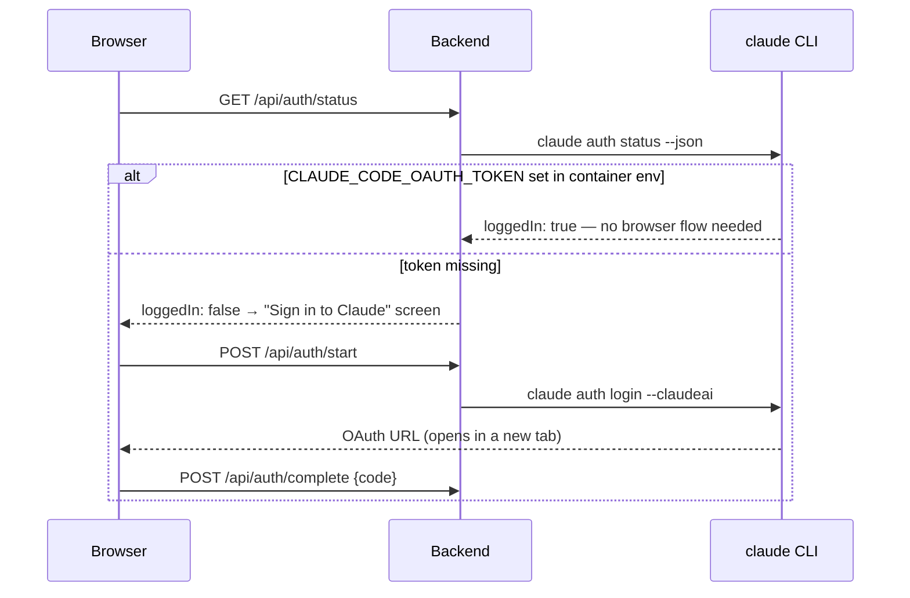

# JIRA Agent

A read-only JIRA Intelligence Agent for Qure.ai's operations team. It answers
questions about CHU tickets, writes standalone Python report/automation
scripts, and drafts scheduled-digest specs — all against a live JIRA Cloud
instance, never mutating a ticket.

Under the hood it's **headless Claude Code** (a system prompt + a handful of
tool scripts) wrapped in a streaming web chat (FastAPI + Vite), scaffolded
from Qure's agent template via the `agent-builder` skill.

## Integrations

| Integration | What it's for | How it's wired |
|---|---|---|
| **JIRA Cloud REST API** (`aiinovation.atlassian.net`) | The agent's only data source — CHU project tickets | `scripts/_jira_client.py`: Basic Auth (qPartner integration service account), `POST /rest/api/3/search/jql` for queries, `GET /rest/api/3/issue/{key}` for detail. **Read-only** — no endpoint anywhere in `scripts/` can create, update, transition, or delete a ticket. |
| **Claude Code** (headless) | Runs the agent's reasoning loop inside the container | `CLAUDE_CODE_OAUTH_TOKEN` set directly in Dokploy's Environment tab. If it's missing, the backend falls back to a per-user browser OAuth flow (`claude auth login`) instead — see the auth flow diagram below. |
| **Dokploy** | Hosting | Single combined Dockerfile build (`app/Dockerfile`): the Vite SPA is built and baked into the FastAPI backend's static dir, one container, one port (`4003`). Deployed at `qhive-app-jira-agent.aetheriaops.com`. |

## System design

## How the agent thinks: 3 modes

Every question is funneled progressively — qTrack (all tickets) → hospital →
product → category → specific criteria — before an answer is surfaced.

## One chat turn, end to end

## Auth flow

## What's here

| Path | What it is |
|---|---|
| `system_prompt.md` | The agent's instructions: identity, the 3 modes, the progressive-funnel filtering rule, and the hard read-only rules. |
| `scripts/` | The agent's tools — `_jira_client.py` (shared read-only REST client), `jira_search.py` (JQL search, `--all` for pagination), `jira_get_issue.py` (single-ticket detail), `test_connection.py`. |
| `docs/` | `jira_fields.md` — CHU's custom field IDs (Ticket Category, Site/Hospital, Product, Priority, etc.). |
| `pyproject.toml` | Python deps for `scripts/` (stdlib-only today — no external deps needed). |
| `app/` | The harness: FastAPI backend (AG-UI streaming) + Vite chat frontend. Don't need to touch it for day-to-day changes. |

## Scaffolding history

Built from Qure's agent template via the `agent-builder` skill, then extended:

1. **Scaffold** — copied from the template, git-initialized.
2. **JIRA tools** — read-only REST client + search/get-issue/test-connection scripts, system prompt authored to spec.
3. **Deploy fix** — `app/Dockerfile` still had stale `COPY` lines from a different agent's build (a warehouse-schema doc, a root `uv.lock`) that don't exist here; pointed at this repo's own `docs/` and dropped the unused lock requirement.
4. **Theme** — replaced the template's orange/amber accents with a JIRA blue + resolved-green palette; renamed "Agent" branding to "JIRA Agent" throughout.
5. **Pagination + UX** — added `--all` to `jira_search.py` (JIRA's search API caps at ~100 results per page regardless of `--max`) and 3 clickable sample questions on the empty-chat screen.
6. **Reliability fix** — a run that ends abnormally (dropped stream, crashed subprocess) now always finalizes its message bubble instead of leaving the cursor blinking forever.
7. **Download button** — any generated script (a fenced code block with a language tag) gets a header with a Download button, saved client-side as the right file extension.
8. **Layout fix** — sidebar header and topbar heights pinned to the same 48px so their border lines align instead of stepping.

## Run it locally

1. **Get a Claude token:** `claude setup-token` where you're logged in (or ask the Agentic AI team).
2. `cp app/.env.example app/.env`, fill in `CLAUDE_CODE_OAUTH_TOKEN`, `JIRA_BASE_URL`, `JIRA_EMAIL`, `JIRA_API_TOKEN`.
3. `cd app && docker compose up --build`
4. Open **http://localhost:5175** and chat with the agent.

## Deploy (Dokploy)

Single-image build — build context is the **repo root**, not `app/`:

| Field | Value |
|---|---|
| Docker File | `app/Dockerfile` |
| Docker Context Path | `.` |
| Port | `4003` |

Set `CLAUDE_CODE_OAUTH_TOKEN`, `JIRA_BASE_URL`, `JIRA_EMAIL`, `JIRA_API_TOKEN`
directly in the app's own **Environment** tab — this build never reads
`app/.env` (that file only matters for local `docker compose` dev).

## Make it yours

- **Instructions:** edit `system_prompt.md`.
- **Tools:** add scripts in `scripts/` (and their deps in `pyproject.toml`). Config (API keys) goes in `app/.env` for local dev + the app's Environment tab for the real deploy.
- **Knowledge:** drop `.md` files in `docs/`.
